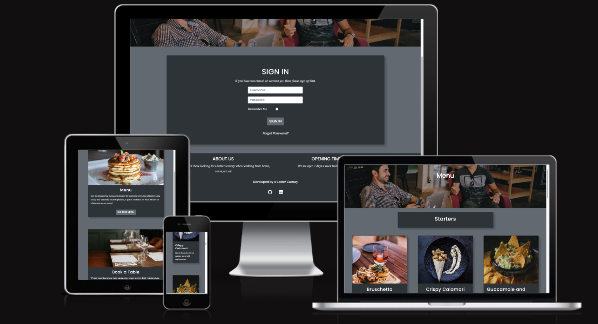
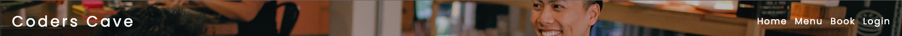
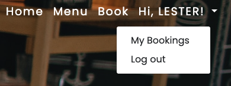
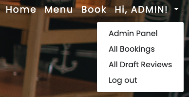
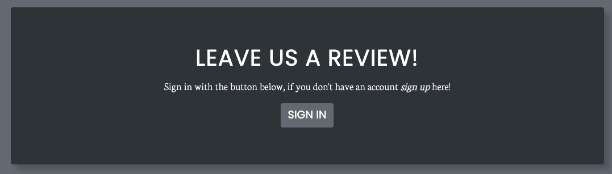
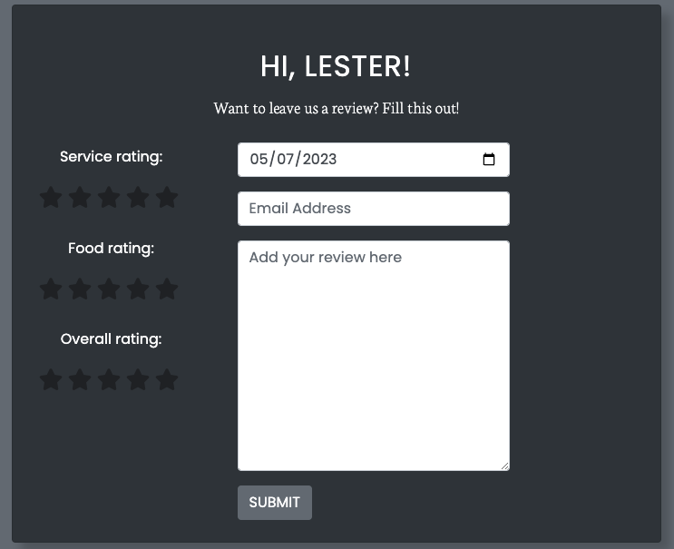

# __Coderscave - Portfolio Project 4__
Welcome to my 4th Project for Code Institute this is a Full-Stack project which involves HTML, CSS, JavaScript, Python +Django and Postgres, this project is deployed through [Heroku](https://heroku.com/).

Coderscave is a restaurant based website which caters for those looking for a better working atmosphere rather than working from home, if this is you come join us!



## __Live Site__

The deployed project can be found here - [Coderscave](https://coders-cave-project-4.herokuapp.com/)

## __Table of Contents__
- [UX & Design](#ux--design)
    - [User Stories](#user-stories)
        - [New User](#new-user)
        - [Existing User](#existing-user)
        - [Site Admin](#site-admin)
    - [Wireframes](#wireframes)
    - [Colour Scheme](#colour-scheme)
    - [Typography](#typography)
- [Features](#features)
    - [Logo and Navigation](#logo-and-navigation)
    - [Hero Image](#hero-image)
    - [Footer](#footer)
    - [Review Form](#review-form)
- [](#)
- [](#)
- [](#)
- [](#)
- [](#)
- [](#)
- [](#)
- [](#)
- [](#)
- [](#)
- [](#)
- [](#)
- [](#)

## __UX & Design__

### __User Stories__

#### __New User__
- As a new user I can sign up so that I can access features only registered users can `(MUST HAVE)`

#### __Existing User__
- As a user I can sign in so that I can book for a table and add a review `(MUST HAVE)`
- As a user I can reset my password so that I can change my password when I cannot remember it `(MUST HAVE)`
- As a user I can easily navigate the homepage so that I can get to the correct part of the website with ease `(MUST HAVE)`
- As a user I can view my bookings so that I can see when my bookings are `(MUST HAVE)`
- As a user I can update my booking so that I can change them depending on availability `(MUST HAVE)`
- As a user I can delete my booking so that I can cancel them if i cannot make it anymore `(MUST HAVE)`
- As a user I can add a review so that give feedback about my booking `(MUST HAVE)`
- As a user I can view other peoples review so that I can see past experiences `(MUST HAVE)`
- As a user I can get a booking confirmation email so that I can remember when my booking is `(SHOULD HAVE)`
- As a user I can get an email regarding booking update so that I can remember the new booking details `(SHOULD HAVE)`
- As a user I can get a cancellation email so that I can confirm my booking is cancelled `(SHOULD HAVE)`
- As a user I want to be able to view email that is designed and not just basic text so that I have a better user experience `(COULD HAVE)`
- As a usr I want to be able to navigate back to the website from the email sent to me so that I can get back to the website with ease `(COULD HAVE)`
- As a user I can receive an email confirmation when my review is publish so that I am aware that my review has been confirmed `(COULD HAVE)`
- As a user I can like/unlike reviews so that i can interact with other users `(WONT HAVE)`
- As a user I can update my review so that I can modify my comments `(WONT HAVE)`
- As a user I can delete a review so that I can delete my review `(WONT HAVE)`

#### __Site Admin__
- As a site admin I can see all bookings so that I can see how many people are booked `(MUST HAVE)`
- As a site admin I can see all drafted reviews so that I can publish them `(MUST HAVE)`
- As a site admin I can publish reviews so that they can be seen by users `(MUST HAVE)`
- As a site admin I can update or delete use bookings so that I can do it for the customer when they request it `(SHOULD HAVE)`
- As a site admin I can delete reviews so that I can delete reviews that are not suitable for other users `(SHOULD HAVE)`
- As a Site Admin I can ban users from booking so that if they are not allowed back in the restaurant they cannot book `(WONT HAVE)`

### __Wireframes__

### __Colour Scheme__
As my project uses [bootstrap](https://getbootstrap.com/docs/4.6/getting-started/introduction/) the colour scheme I used are the ones that are provided in their css :root

```
:root {
    --white: #fff;
    --secondary: #6c757d;
    --dark: #343a40;
}
```

```
--dark: #343a40;
```
This is used for the background of the navbar and footer.

```
--secondary: #6c757d;
```
This is used for the colour of the body to seperate it from the navbar and footer.

```
--white: #fff;
```
This is used for the text colour so that the content can be easily seen in both --dark and --secondary backgrounds.


### __Typography__

For the website, I am using [Google Font](https://fonts.google.com/) I decided to use Poppins for the heading text of the website and Neuton for the body text.

At the beginning I wanted to implement Poppins as the font as it is easy to read, I found the font pairings using [Fontjoy](https://fontjoy.com/).

## __Features__

### __Logo and Navigation__

- The logo and navigation bar appears on every page of the website, Each of the links will send the user to the targeted pages. After the user logs in the "login" text will be replaced with "Hi, (user)!" and a dropdown element will be accessible to see role-based functionality.



Normal user:

As a normal user they will be able to access "My Bookings" which when they book a table, all their bookings will be shown here. Also a log out functionality is available.



Superuser: 

As a superuser the drop down changes to be able to access the "Admin Panel" from the website instead of having to type "/admin" into the url.

"All Bookings" is the path to see all the bookings made by any user.

"All Draft Review" is the path to see all the draft reviews submitted by users, in this page the admin and only the admin can publish the reviews.



### __Hero Image__

- The hero image is implemented in every page of the website, the text will change depending on which page the user is currently on. For example if the user clicks on the "Menu" page the text title will be "Menu".


### __Footer__

- The footer appears in every page across the website (except for the error pages), the footer includes an about us with a brief description and opening times. It also has links to my github and linkedin, the copyright year has a script that will update depending on what year we are currently in.


### __Review Form__

- The review form can be found in the home page of the website, parameters has been set that the user has to be logged in to be able to access the form this was done by using django's template language ``` ```.

User not logged in:



User logged in:




