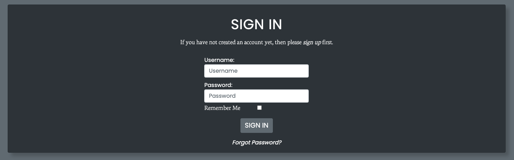
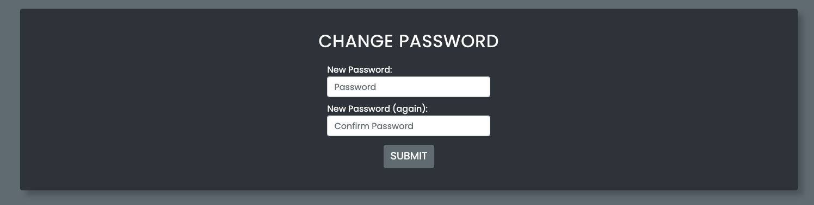
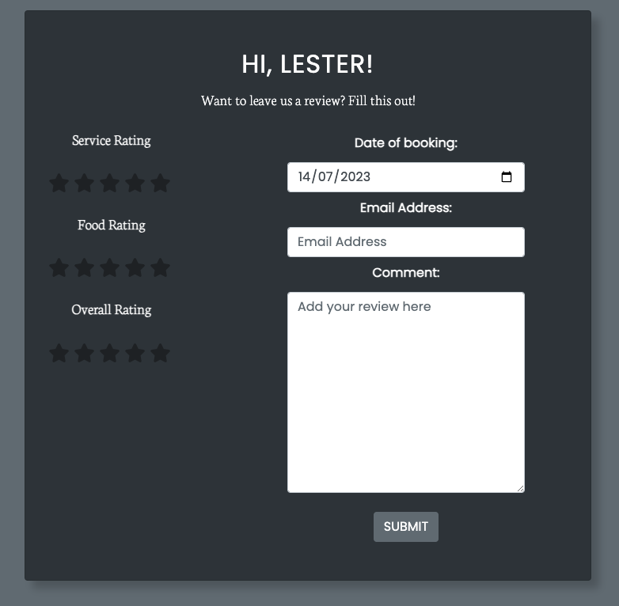
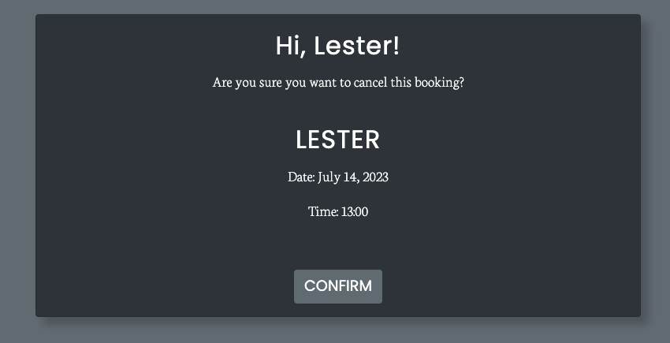

# __Coderscave - Portfolio Project 4__
Welcome to my 4th Project for Code Institute this is a Full-Stack project which involves HTML, CSS, JavaScript, Python +Django and Postgres, this project is deployed through [Heroku](https://heroku.com/).

Coderscave is a restaurant based website which caters for those looking for a better working atmosphere rather than working from home, if this is you come join us!


## __Live Site__

The deployed project can be found here - [Coderscave](https://coders-cave-project-4.herokuapp.com/)

## __Table of Contents__
- [UX & Design](#ux--design)
    - [User Stories](#user-stories)
        - [New User](#new-user)
        - [Existing User](#existing-user)
        - [Site Admin](#site-admin)
    - [Wireframes](#wireframes)
    - [Colour Scheme](#colour-scheme)
    - [Typography](#typography)
- [Features](#features)
    - [Logo and Navigation](#logo-and-navigation)
        - [Normal User](#normal-user)
        - [Superuser](#superuser)
    - [Hero Image](#hero-image)
    - [Footer](#footer)
    - [User Interface](#user-interface)
        - [Login Page](#login-page)
        - [Signup Page](#signup-page)
        - [Logout Page](#logout-page)
        - [Forgot Password](#forgot-password)
        - [Password Reset Email](#password-reset-email)
        - [Change Password](#change-password)
    - [Review Form](#review-form)
        - [User not logged in](#user-not-logged-in)
        - [User logged in](#user-logged-in)
        - [Review submitted](#review-submitted)
        - [Draft Review](#draft-review-superuser-only)
        - [Published Review](#published-review)
        - [Review Email](#review-email)
    - [Booking Form](#booking-form)
        - [Booking List](#booking-list)
        - [Booking Confirmation Email](#booking-confirmation-email)
        - [Update Booking Form](#update-booking-form)
        - [Update Confirmation Email](#update-confirmation-email)
        - [Delete Booking](#delete-booking)
        - [Delete Confirmation Email](#delete-confirmation-email)
        - [Booking Form Errors](#booking-form-errors)
- [](#)
- [](#)
- [](#)
- [](#)
- [](#)
- [](#)
- [](#)
- [](#)
- [](#)
- [](#)
- [](#)
- [](#)
- [](#)

## __UX & Design__
&nbsp;  
### __User Stories__

#### __New User__:
- As a new user I can sign up so that I can access features only registered users can `(MUST HAVE)`

#### __Existing User__:
- As a user I can sign in so that I can book for a table and add a review `(MUST HAVE)`
- As a user I can reset my password so that I can change my password when I cannot remember it `(MUST HAVE)`
- As a user I can easily navigate the homepage so that I can get to the correct part of the website with ease `(MUST HAVE)`
- As a user I can view my bookings so that I can see when my bookings are `(MUST HAVE)`
- As a user I can update my booking so that I can change them depending on availability `(MUST HAVE)`
- As a user I can delete my booking so that I can cancel them if i cannot make it anymore `(MUST HAVE)`
- As a user I can add a review so that give feedback about my booking `(MUST HAVE)`
- As a user I can view other peoples review so that I can see past experiences `(MUST HAVE)`
- As a user I can get a booking confirmation email so that I can remember when my booking is `(SHOULD HAVE)`
- As a user I can get an email regarding booking update so that I can remember the new booking details `(SHOULD HAVE)`
- As a user I can get a cancellation email so that I can confirm my booking is cancelled `(SHOULD HAVE)`
- As a user I want to be able to view email that is designed and not just basic text so that I have a better user experience `(COULD HAVE)`
- As a usr I want to be able to navigate back to the website from the email sent to me so that I can get back to the website with ease `(COULD HAVE)`
- As a user I can receive an email confirmation when my review is publish so that I am aware that my review has been confirmed `(COULD HAVE)`
- As a user I can like/unlike reviews so that i can interact with other users `(WONT HAVE)`
- As a user I can update my review so that I can modify my comments `(WONT HAVE)`
- As a user I can delete a review so that I can delete my review `(WONT HAVE)`

#### __Site Admin__:
- As a site admin I can see all bookings so that I can see how many people are booked `(MUST HAVE)`
- As a site admin I can see all drafted reviews so that I can publish them `(MUST HAVE)`
- As a site admin I can publish reviews so that they can be seen by users `(MUST HAVE)`
- As a site admin I can update or delete use bookings so that I can do it for the customer when they request it `(SHOULD HAVE)`
- As a site admin I can delete reviews so that I can delete reviews that are not suitable for other users `(SHOULD HAVE)`
- As a Site Admin I can ban users from booking so that if they are not allowed back in the restaurant they cannot book `(WONT HAVE)`

&nbsp;  
### __Wireframes__
&nbsp;  
### __Colour Scheme__
As my project uses [bootstrap](https://getbootstrap.com/docs/4.6/getting-started/introduction/) the colour scheme I used are the ones that are provided in their css :root

```css
:root {
    --white: #fff;
    --secondary: #6c757d;
    --dark: #343a40;
}
```

```css
--dark: #343a40;
```
This is used for the background of the navbar and footer.

```css
--secondary: #6c757d;
```
This is used for the colour of the body to seperate it from the navbar and footer.

```css
--white: #fff;
```
This is used for the text colour so that the content can be easily seen in both --dark and --secondary backgrounds.

&nbsp;  
### __Typography__

For the website, I am using [Google Font](https://fonts.google.com/) I decided to use Poppins for the heading text of the website and Neuton for the body text.

At the beginning I wanted to implement Poppins as the font as it is easy to read, I found the font pairings using [Fontjoy](https://fontjoy.com/).

&nbsp;  
## __Features__
&nbsp;  
### __Logo and Navigation__

- The logo and navigation bar appears on every page of the website, Each of the links will send the user to the targeted pages. After the user logs in the "login" text will be replaced with "Hi, (user)!" and a dropdown element will be accessible to see role-based functionality.


#### __Normal user__:

- As a normal user they will be able to access "My Bookings" which when they book a table, all their bookings will be shown here. Also a log out functionality is available.


#### __Superuser__:

- As a superuser the drop down changes to be able to access the "Admin Panel" from the website instead of having to type "/admin" into the url.

- "All Bookings" is the path to see all the bookings made by any user.

- "All Draft Review" is the path to see all the draft reviews submitted by users, in this page the admin and only the admin can publish the reviews.


&nbsp;  
### __Hero Image__

- The hero image is implemented in every page of the website, the text will change depending on which page the user is currently on. For example if the user clicks on the "Menu" page the text title will be "Menu".


&nbsp;  
### __Footer__

- The footer appears in every page across the website (except for the error pages), the footer includes an about us with a brief description and opening times. It also has links to my github and linkedin, the copyright year has a script that will update depending on what year we are currently in.


&nbsp;  
### __User Interface__

- All the models and functionalities are from [django-allauth](https://django-allauth.readthedocs.io/en/latest/), which I then extended my base.html through the accounts/templates to be able to override the default allauth template.

&nbsp;  
#### __Login Page__

- The login link can be found on the navbar when clicked it will take you to this page:



- If the user does not click on the "Remember Me" checkbox when they close the browser they will be automatically logged out. Unfortunately closing the tab will not end the session cookie so it has to be the full browser.

&nbsp;  
#### __Signup Page__

- If the user does not have an account they can make one using this page:


&nbsp;  
#### __Logout Page__

- When the user wants to end their session they can do this from the navbar in the drop down and click logout and it will take you to this page:


&nbsp;  
#### __Forgot Password__

- If the user forgets their password they can fill this form to be able to change their password.


&nbsp;  
#### __Password Reset Email__

- The user will get an email with a link back to the website to reset their password.


- If the link has already been used, this will be shown instead:


&nbsp;  
#### __Change Password__

- If the link has not been used yet, the user can change their password from this page:



&nbsp;  
### __Review Form__

- The review form can be found in the home page of the website, parameters has been set that the user has to be logged in to be able to access the form this was done by using django's template language:

``` ```

#### __User not logged in__:


#### __User logged in__:



&nbsp;  
#### __Review Submitted__:

- When the user succesfully submit a review, they will be redirected to the success page.


&nbsp;  
#### __Draft Review__ (Superuser Only):

- When a review has been succesfully been submitted, the superuser can access this by viewing "All Draft Reviews" page. On this page, the user has two functionalities to publish or to delete the review.

- When a non-superuser tries to access this page by typing the path to the page in the url tab they will be redirected to the 403 page. This was achieved by this code: 

```py
if not request.user.is_superuser:
        raise PermissionDenied
```


- When there are no reviews in the database, this will show instead:


&nbsp;  
#### __Published Review__:

- When a superuser publishes a draft review, the review can be seen back on the homepage on the bottom of the page. The delete button option is only accessible to superusers, when a non-superuser is looking at the published reviews the delete button will not be visible. When there are multiple reviews published, the container will allow 3 reviews per row then will make new rows below it. So that the homepage will not be too large when there are multiple of reviews published I allowed the container to be scrolled vertically.


&nbsp;  
#### __Review Email__:

- When a review gets published the user that submitted the review will be sent an email confirmation that their review has been published and can be seen on the website.


&nbsp;  
### __Booking Form__

- The booking form can be found on the navbar by clicking on "book", although to be able to access the form the user has to be logged in. If they are not logged in they will be redirected to the login page. This was achieved by using this decorator ontop of the view handler:

```py
@login_required
```


&nbsp;  

#### __Booking List__:

- After the form has been submitted the user will be redirected to the "My Bookings" page, in this page they can see all the bookings they have made and have an option to either edit or delete their booking.


&nbsp;  

#### __Booking Confirmation Email__:

- When the user successfully submit a form they will recieve a confirmation email:


&nbsp;  

#### __Update Booking Form__:

- The update booking form is the same layout as the normal booking form, the only difference is the text changes to "Update your booking below"


&nbsp;  

#### __Update Confirmation Email__:

- When the user updates their booking, they will also receive another confirmation email about updating their booking.


&nbsp;  

#### __Delete Booking__:

- The user also has the option to delete their booking if they are no longer want their appointment.



&nbsp;  

#### __Delete Confirmation Email__:

- When the user deletes their booking, they will also recieve another confirmation email about the changes.


&nbsp;  


#### __Booking Form Errors__:

- Every field except from "Special Requirements" in the form are required for the form to be valid.

- When a user books a certain date and time no other users can book the same time as them. This error will show on the bottom of the form: 


- The user cannot book in the past and also they can only book one month in advance.


- The code below was used to achieve this function it can be found in bookings/forms.py:

```py
def clean_date(self):
        selected_date = self.cleaned_data.get("date")
        selected_time = self.cleaned_data.get("time")
        max_date = date.today() + timedelta(days=30)

        if selected_date and selected_date > max_date:
            error_message = "You can only book up to one month in advance, " \
                            "Please choose another date."
            raise ValidationError(error_message)

        if selected_date and selected_date < date.today():
            error_message = "You cannot book in the past, " \
                            "Please choose a date in the present."
            raise ValidationError(error_message)

        return selected_date

    def clean_time(self):
        selected_date = self.cleaned_data.get("date")
        selected_time = self.cleaned_data.get("time")

        if selected_date and selected_time:
            existing_booking = BookingForm.objects.filter(
                date=selected_date, time=selected_time
            )
            if existing_booking.exists():
                error_message = "The timeslot on this day is alreay booked, " \
                                "Please choose another timeslot."
                raise ValidationError(error_message)

        return selected_time
```

&nbsp;  


