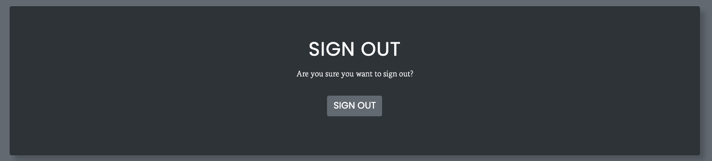
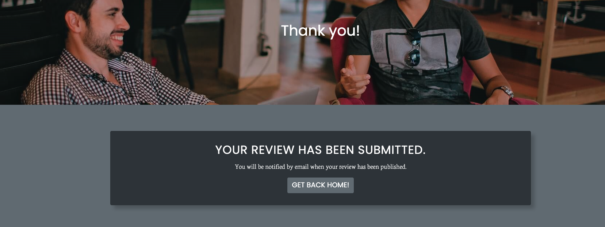
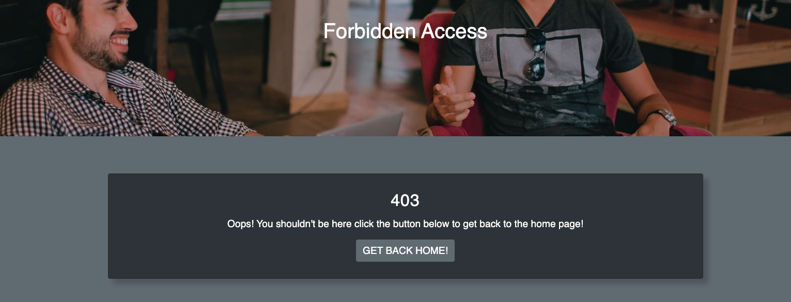
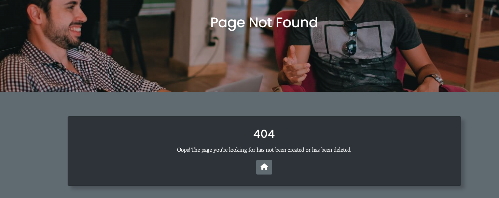

# __Coderscave - Portfolio Project 4__
Welcome to my 4th Project for Code Institute this is a Full-Stack project which involves HTML, CSS, JavaScript, Python +Django and Postgres, this project is deployed through [Heroku](https://heroku.com/).

Coderscave is a restaurant based website which caters for those looking for a better working atmosphere rather than working from home, if this is you come join us!


## __Live Site__

The deployed project can be found here - [Coderscave](https://coders-cave-project-4.herokuapp.com/)

## __Table of Contents__
- [UX & Design](#ux--design)
    - [User Stories](#user-stories)
        - [New User](#new-user)
        - [Existing User](#existing-user)
        - [Site Admin](#site-admin)
    - [Wireframes](#wireframes)
        - [Homepage](#homepage)
        - [Menu](#menu)
        - [Book](#book)
        - [Bookings List](#bookings-list)
        - [Reviews List](#reviews-list)
    - [Colour Scheme](#colour-scheme)
    - [Typography](#typography)
- [Features](#features)
    - [Logo and Navigation](#logo-and-navigation)
        - [Normal User](#normal-user)
        - [Superuser](#superuser)
    - [Hero Image](#hero-image)
    - [Footer](#footer)
    - [User Interface](#user-interface)
        - [Login Page](#login-page)
        - [Signup Page](#signup-page)
        - [Logout Page](#logout-page)
        - [Forgot Password](#forgot-password)
        - [Password Reset Email](#password-reset-email)
        - [Change Password](#change-password)
    - [Review Form](#review-form)
        - [User not logged in](#user-not-logged-in)
        - [User logged in](#user-logged-in)
        - [Review submitted](#review-submitted)
        - [Draft Review](#draft-review-superuser-only)
        - [Published Review](#published-review)
        - [Review Email](#review-email)
    - [Booking Form](#booking-form)
        - [Booking List](#booking-list)
        - [Booking Confirmation Email](#booking-confirmation-email)
        - [Update Booking Form](#update-booking-form)
        - [Update Confirmation Email](#update-confirmation-email)
        - [Delete Booking](#delete-booking)
        - [Delete Confirmation Email](#delete-confirmation-email)
        - [Booking Form Errors](#booking-form-errors)
        - [All Booking List](#all-booking-list-superuser-only)
    - [Error Pages](#error-pages)
    - [Future Features](#future-features)
- [Languages & Technologies Used](#languages--technologies-used)
- [Database Design](#database-design)
    - [Models](#models)
- [Agile Tool](#agile-tool)
    - [GitHub Projects](#github-projects)
    - [GitHub Issues](#github-issues)
    - [User Story Prioritization](#user-story-prioritization)
- [Testing](#testing)
- [Deployment](#deployment)
- [Credits](#credits)

## __UX & Design__
&nbsp;  
### __User Stories__

#### __New User__:
- As a new user I can sign up so that I can access features only registered users can `(MUST HAVE)`

#### __Existing User__:
- As a user I can sign in so that I can book for a table and add a review `(MUST HAVE)`
- As a user I can reset my password so that I can change my password when I cannot remember it `(MUST HAVE)`
- As a user I can easily navigate the homepage so that I can get to the correct part of the website with ease `(MUST HAVE)`
- As a user I can view my bookings so that I can see when my bookings are `(MUST HAVE)`
- As a user I can update my booking so that I can change them depending on availability `(MUST HAVE)`
- As a user I can delete my booking so that I can cancel them if i cannot make it anymore `(MUST HAVE)`
- As a user I can add a review so that give feedback about my booking `(MUST HAVE)`
- As a user I can view other peoples review so that I can see past experiences `(MUST HAVE)`
- As a user I can get a booking confirmation email so that I can remember when my booking is `(SHOULD HAVE)`
- As a user I can get an email regarding booking update so that I can remember the new booking details `(SHOULD HAVE)`
- As a user I can get a cancellation email so that I can confirm my booking is cancelled `(SHOULD HAVE)`
- As a user I want to be able to view email that is designed and not just basic text so that I have a better user experience `(COULD HAVE)`
- As a usr I want to be able to navigate back to the website from the email sent to me so that I can get back to the website with ease `(COULD HAVE)`
- As a user I can receive an email confirmation when my review is publish so that I am aware that my review has been confirmed `(COULD HAVE)`
- As a user I can like/unlike reviews so that i can interact with other users `(WONT HAVE)`
- As a user I can update my review so that I can modify my comments `(WONT HAVE)`
- As a user I can delete a review so that I can delete my review `(WONT HAVE)`

#### __Site Admin__:
- As a site admin I can see all bookings so that I can see how many people are booked `(MUST HAVE)`
- As a site admin I can see all drafted reviews so that I can publish them `(MUST HAVE)`
- As a site admin I can publish reviews so that they can be seen by users `(MUST HAVE)`
- As a site admin I can update or delete use bookings so that I can do it for the customer when they request it `(SHOULD HAVE)`
- As a site admin I can delete reviews so that I can delete reviews that are not suitable for other users `(SHOULD HAVE)`
- As a Site Admin I can ban users from booking so that if they are not allowed back in the restaurant they cannot book `(WONT HAVE)`

&nbsp;  
### __Wireframes__

As part of my planning stage I created a base design using [Figma](https://www.figma.com/). At this stage I already chose my colour scheme through looking at the bootstrap documentation, so instead of doing a blank wireframe I decided to implement what colours I wanted to use for which part of the website.

Though throughout the creation of the website the design of my website slighty changes particulary the mobile view.

#### __Homepage__

__Desktop__


__Mobile__


&nbsp;  
#### __Menu__

__Desktop__


__Mobile__


&nbsp;  
#### __Book__

__Desktop__


__Mobile__


&nbsp;  
#### __Bookings List__

__Desktop__


__Mobile__


&nbsp;  
#### __Reviews List__

__Desktop__


__Mobile__


As for the User Interface such as the login/logout/signout/delete pages I did not make a design for this, but as the project progressed I made sure that these pages matches the layout of the website.

&nbsp;  
### __Colour Scheme__
As my project uses [bootstrap](https://getbootstrap.com/docs/4.6/getting-started/introduction/) the colour scheme I used are the ones that are provided in their css :root

```css
:root {
    --white: #fff;
    --secondary: #6c757d;
    --dark: #343a40;
}
```

```css
--dark: #343a40;
```
This is used for the background of the navbar and footer.

```css
--secondary: #6c757d;
```
This is used for the colour of the body to seperate it from the navbar and footer.

```css
--white: #fff;
```
This is used for the text colour so that the content can be easily seen in both --dark and --secondary backgrounds.

&nbsp;  
### __Typography__

For the website, I am using [Google Font](https://fonts.google.com/) I decided to use Poppins for the heading text of the website and Neuton for the body text.

At the beginning I wanted to implement Poppins as the font as it is easy to read, I found the font pairings using [Fontjoy](https://fontjoy.com/).

&nbsp;  
## __Features__
&nbsp;  
### __Logo and Navigation__

- The logo and navigation bar appears on every page of the website, Each of the links will send the user to the targeted pages. After the user logs in the "login" text will be replaced with "Hi, (user)!" and a dropdown element will be accessible to see role-based functionality.


#### __Normal user__:

- As a normal user they will be able to access "My Bookings" which when they book a table, all their bookings will be shown here. Also a log out functionality is available.


#### __Superuser__:

- As a superuser the drop down changes to be able to access the "Admin Panel" from the website instead of having to type "/admin" into the url.

- "All Bookings" is the path to see all the bookings made by any user.

- "All Draft Review" is the path to see all the draft reviews submitted by users, in this page the admin and only the admin can publish the reviews.


&nbsp;  
### __Hero Image__

- The hero image is implemented in every page of the website, the text will change depending on which page the user is currently on. For example if the user clicks on the "Menu" page the text title will be "Menu".


&nbsp;  
### __Footer__

- The footer appears in every page across the website (except for the error pages), the footer includes an about us with a brief description and opening times. It also has links to my github and linkedin, the copyright year has a script that will update depending on what year we are currently in.


&nbsp;  
### __User Interface__

- All the models and functionalities are from [django-allauth](https://django-allauth.readthedocs.io/en/latest/), which I then extended my base.html through the accounts/templates to be able to override the default allauth template.

&nbsp;  
#### __Login Page__

- The login link can be found on the navbar when clicked it will take you to this page:

__Desktop__


__Mobile__


- If the user does not click on the "Remember Me" checkbox when they close the browser they will be automatically logged out. Unfortunately closing the tab will not end the session cookie so it has to be the full browser.

&nbsp;  
#### __Signup Page__

- If the user does not have an account they can make one using this page:

__Desktop__


__Mobile__


&nbsp;  
#### __Logout Page__

- When the user wants to end their session they can do this from the navbar in the drop down and click logout and it will take you to this page:

__Desktop__



__Mobile__


&nbsp;  
#### __Forgot Password__

- If the user forgets their password they can fill this form to be able to change their password.

__Desktop__


__Mobile__


&nbsp;  
#### __Password Reset Email__

- The user will get an email with a link back to the website to reset their password.


- If the link has already been used, this will be shown instead:

__Desktop__


__Mobile__


&nbsp;  
#### __Change Password__

- If the link has not been used yet, the user can change their password from this page:

__Desktop__


__Mobile__


&nbsp;  
### __Review Form__

- The review form can be found in the home page of the website, parameters has been set that the user has to be logged in to be able to access the form this was done by using django's template language:

``` ```

#### __User not logged in__:

__Desktop__


__Mobile__


#### __User logged in__:

__Desktop__


__Mobile__


&nbsp;  
#### __Review Submitted__:

- When the user succesfully submit a review, they will be redirected to the success page.



&nbsp;  
#### __Draft Review__ (Superuser Only):

- When a review has been succesfully been submitted, the superuser can access this by viewing "All Draft Reviews" page. On this page, the user has two functionalities to publish or to delete the review.

- When a non-superuser tries to access this page by typing the path to the page in the url tab they will be redirected to the 403 page. This was achieved by this code: 

```py
if not request.user.is_superuser:
        raise PermissionDenied
```


- When there are no reviews in the database, this will show instead:


&nbsp;  
#### __Published Review__:

- When a superuser publishes a draft review, the review can be seen back on the homepage on the bottom of the page. The delete button option is only accessible to superusers, when a non-superuser is looking at the published reviews the delete button will not be visible. When there are multiple reviews published, the container will allow 3 reviews per row then will make new rows below it. So that the homepage will not be too large when there are multiple of reviews published I allowed the container to be scrolled vertically.


&nbsp;  
#### __Review Email__:

- When a review gets published the user that submitted the review will be sent an email confirmation that their review has been published and can be seen on the website.


&nbsp;  
### __Booking Form__

- The booking form can be found on the navbar by clicking on "book", although to be able to access the form the user has to be logged in. If they are not logged in they will be redirected to the login page. This was achieved by using this decorator ontop of the view handler:

```py
@login_required
```

__Desktop__


__Mobile__


&nbsp;  

#### __Booking List__:

- After the form has been submitted the user will be redirected to the "My Bookings" page, in this page they can see all the bookings they have made and have an option to either edit or delete their booking. This was done by this code:

```py
    bookings = BookingForm.objects.filter(user=request.user).order_by("-id")
```

__Desktop__


__Mobile__


&nbsp;  

#### __Booking Confirmation Email__:

- When the user successfully submit a form they will recieve a confirmation email:


&nbsp;  

#### __Update Booking Form__:

- The update booking form is the same layout as the normal booking form, the only difference is the text changes to "Update your booking below". After the user update their booking they will be redirected back to the "My Bookings" page.

&nbsp;  

#### __Update Confirmation Email__:

- When the user updates their booking, they will also receive another confirmation email about updating their booking.


&nbsp;  

#### __Delete Booking__:

- The user also has the option to delete their booking if they no longer want their appointment. After the user delete their booking they will be redirected back to the "My Bookings" page.

__Desktop__


__Mobile__


&nbsp;  

#### __Delete Confirmation Email__:

- When the user deletes their booking, they will also recieve another confirmation email about the changes.


&nbsp;  


#### __Booking Form Errors__:

- Every field except from "Special Requirements" in the form are required for the form to be valid.

- When a user books a certain date and time no other users can book the same time as them. This error will show on the bottom of the form: 


- The user cannot book in the past and also they can only book one month in advance.


- The code used to achieve this function can be found in [bookings/forms.py](https://github.com/LesterCuasay/Project-4/blob/main/bookings/forms.py) on line 100.

&nbsp;  

#### __All Booking List__ (Superuser Only):

- When there are bookings in the database the superuser can see all of the bookings in the "All Bookings" page, only the superuser can access this page. This was done by this code:

```py
if not request.user.is_superuser:
        raise PermissionDenied

    bookings = BookingForm.objects.all().order_by("-id")
```

__Desktop__


__Mobile__


- The admin also has functionalities to update or delete users bookings if the user requests for them to do it. The layout of the update and delete pages are the same for superusers except the text changes to "Update the customers booking below!". When the superuser updates or deletes a users booking they will also get an email confirmation about the changes and also instead of being redirected back to the "My Bookings" page the superuser will get redirected back to the "All Bookings" page instead. This was achieved by this code:

```py
if request.user.is_superuser:
    return redirect("view_all_bookings")
```

&nbsp;  
### __Error Pages__

- I have implemented my own error pages for the 403, 404 and 500 html errors these are the templates below:






&nbsp;  
### __Future Features__

There are definitely more functionalities I wanted to implement in this project, the features below are logged as "WONT HAVE" in my MoSCoW prioritization.

- Update Review:
    - As a user I want them to be able to update their own draft reviews to amend their comment.

- Delete Review:
    - As a user I want them to be able to delete their own draft reviews if they no longer want it to be published.

- Like/Unlike Reviews:
    - As a user I want them to be able to interact with the published reviews by liking them.

- Ban users:
    - As a site admin I want them to be able to ban existing users if they have caused issues during their time with us.

&nbsp;  
## __Languages & Technologies Used__

- [HTML](https://en.wikipedia.org/wiki/HTML5) - used for main content for the site.
- [CSS3](https://en.wikipedia.org/wiki/CSS) - used to style the sites layout.
- [Javascript](https://www.javascript.com/) - used with bootstrap and also my star ratings and date functions.
- [Bootstrap](https://getbootstrap.com/docs/4.6/getting-started/introduction/) - used as the front-end framework.
- [Django](https://www.djangoproject.com/) - used as the Python framework.
- [PostgreSQL](https://www.postgresql.org/) - used as the relational database management.
- [ElephantSQL](https://www.elephantsql.com/) - used as the Postgres database.
- [Cloudinary](https://cloudinary.com/) - used for online static file storage.
- [Gmail](https://www.google.com/gmail/about/) - used to create an email address to send emails from.
- [Heroku](https://heroku.com/) - used for hosting of deployed site.
- [Font Awesome](https://fontawesome.com/) - used for the icons on the footer.
- [Google Fonts](https://fonts.google.com/) - used for the font styles for the site.
- [Figma](https://www.figma.com/) - used to design my wireframes.

&nbsp;  
## __Database Design__

&nbsp;  
### __Models__:

- Booking Form:

| PK | ID                   | Type          | Notes            |
|----|----------------------|---------------|------------------|
| FK | user                 | OneToOne      | FK to User Model |
|    | name                 | Charfield     |                  |
|    | email                | EmailField    |                  |
|    | number_of_people     | IntergerField |                  |
|    | date                 | DateField     |                  |
|    | time                 | TimeField     |                  |
|    | special_requirements | TextField     |                  |

- Review Form:

| PK | ID             | Type          | Notes            |
|----|----------------|---------------|------------------|
| FK | author         | OneToOne      | FK to User Model |
|    | date           | DateField     |                  |
|    | email          | EmailField    |                  |
|    | service_rating | IntergerField |                  |
|    | food_rating    | IntergerField |                  |
|    | overall_rating | IntergerField |                  |
|    | created_at     | DateTimeField |                  |
|    | status         | IntergerField |                  |

- Usel Model:

    - The user model was built using [django-allauth](https://django-allauth.readthedocs.io/en/latest/).

&nbsp;  
## __Agile Tool__

&nbsp;  
### __GitHub Projects__:

[GitHub Projects](https://github.com/LesterCuasay/Project-4/projects?query=is%3Aopen) served as an agile tool for this project, the purpose of this was to proactively map out the project which I will admit I did not use to its full advantages as I was more focused on the coding of the website resulting to not updating my progression through the projects board.


&nbsp;  
### __GitHub Issues__:

[GitHub Issues](https://github.com/LesterCuasay/Project-4/issues) served as another Agile tool, here I used my own user story template and bug template to monitor where I am within the creation of the website.

&nbsp;  
### __User Story Prioritization__:

In my GitHub Issues, I have prioritized my user stories under the MoSCoW method:

- MUST HAVE - needs to be implemented into the website (max 60% of stories)
- SHOULD HAVE - adds better user experience but not needed (~20% of stories)
- COULD HAVE - has little or no impact if left out (20% of stories)
- WON'T HAVE - not a priority feature

&nbsp;  
## __Testing__

The testing for this website can be found in the [TESTING.md](TESTING.md) file.

## __Deployment__

### __ElephantSQL__

This project uses [ElephantSQL](https://www.elephantsql.com/) as the PostgresQL Database, to set this up go to their website and sign up using your Github account and follow their instructions.

- Create a new instance, this can be found on the top right of the page.
- Provide a name for the new instance, select "Tiny Turtle (Free) for the plan, Tags can be left blank.
- Choose the closest Data Center to you.
- Confirm the creation of your new instance.
- Back on the menu you will find the new instance, click on it and you can view the database URL and Password.

&nbsp;  
### __Cloudinary__

This project uses [Cloudinary](https://cloudinary.com/) to store media files online, to use this for your own project follow the steps below:

- Sign up with GitHub or create an account.
- From the Dashboard you will see the "API Enviroment variable", this will go in our project.

&nbsp;  
### __Heroku__

This project is deployed on [Heroku](https://heroku.com/), deployment steps are listed below:

- On the right click on _New_
- From the drop down click on _Create New App_
- Input the name for your app (app name has to be unique so choose wisely!)
- Choose a region and then click on _Create App_
- From the app settings, click on _Reveal Config Vars_ and set your enviroment variables.

i.e 

| Key            | Value                                         |  
|----------------|-----------------------------------------------|
| CLOUDINARY_URL | insert your own Cloudinary API key here       |
| DATABASE_URL   | insert your own ElephantSQL database URL here |
| SECRET_KEY     | this can be any random secret key             |

To be able to deploy to heroku properly, there are two files that is needed.

- requirements.txt

Everytime you add a package that your project will depend on you need to update your requirements.txt with this code:

> pip3 freeze --local > requirements.txt

Though if you are using your project on a different workspace you can use this code to install the projects requirements:

> pip3 install -r requirements.txt

- Procfile

Inside the procfile file insert this code, replace "app_name" with your projects name:

> web: gunicorn app_name.wsgi

- To deploy in heroku, click on your app and navigate to the "Deploy" tab.
- Connect your project through "Deployment Method".
- Scroll down and either choose "Automatic deploys" or "Manual Deploy"
- Wait for deployment and open your deployed app!

&nbsp;  
## __Credits__

- [Heroku](https://heroku.com/) - For deployment of the app 
- [Code Institute Python Linter](https://pep8ci.herokuapp.com/) - For validating my Python Code
- [Testi@](https://testi.at/) - For helping me create the email html templates
- [MailChimp](https://templates.mailchimp.com/resources/email-client-css-support/) - For giving me guidance on what elements I can use in the email templates
- [Django all-auth docs](https://django-allauth.readthedocs.io/en/latest/forms.html#account-forms) - For showing me how to override their Login/Signup/Logout pages
- [Pexels](https://www.pexels.com/) - For the images used throughout the website
