## __Testing__

Head back to the [README.md](README.md) file.

&nbsp;

## __Introduction__

To make sure that my website is running as intended, I will be using different tools to see its performance.

- Every page will be testing on lighthouse for Desktop and Mobile.
- Every page's HTML will be checked on [W3C Validator](https://validator.w3.org/)
    - For the HTML pages that requires users to be authenticated I will be validating the HTML through direct input using the page source as W3C is not authenticated it will not see my if authenticated template syntax.
- Every page's CSS will be checked on [W3C Validator - Jigsaw](https://jigsaw.w3.org/css-validator/)
- Every Python code will be checked on [Code Institute Python Linter](https://pep8ci.herokuapp.com/)
- Every JavaScript code will be checked on [JShint](https://jshint.com/)

## __Automated Test__

To check if my views and forms are correctly working I implemented automation testing, the results for all tests is shown below:

|              | Screenshot                                   |
|--------------|----------------------------------------------|
| Test Results | 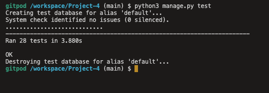 |

Individual test results will be found in the [Python](#python) testing section.

&nbsp;  
## __HTML & Lighthouse__

### __Homepage__

[index.html](https://coders-cave-project-4.herokuapp.com/)

|                    | Screenshot                                                        |              Notes                   |
|--------------------|-------------------------------------------------------------------|--------------------------------------|
| Desktop            | 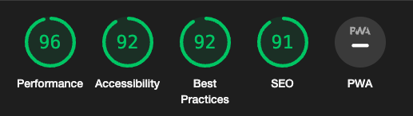 |                                      |
| Mobile             | 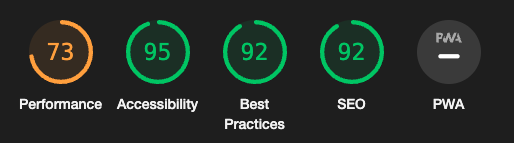   | Performance down due to image sizes. |
| W3C HTML Validator | 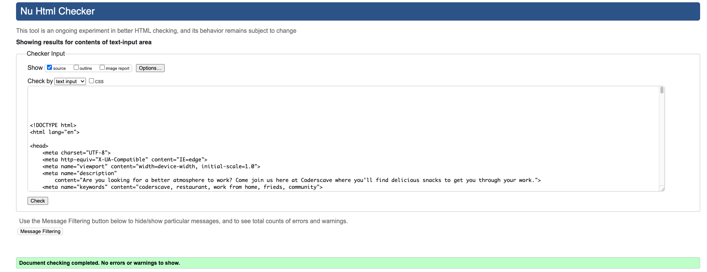        |                                      |

&nbsp;  
### __Menu__

[menu.html](https://coders-cave-project-4.herokuapp.com/menu/)

|                    | Screenshot                                                        |              Notes                   |
|--------------------|-------------------------------------------------------------------|--------------------------------------|
| Desktop            |    |                                      |
| Mobile             | 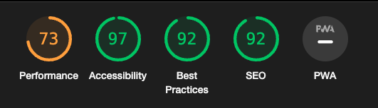     | Performance down due to image sizes. |
| W3C HTML Validator | 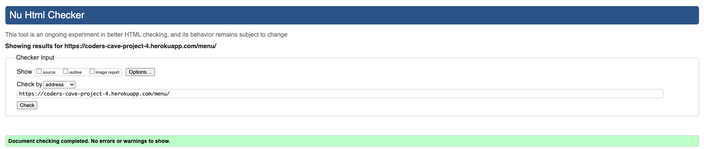          |                                      |

&nbsp;  
### __Book__

[bookings.html](https://coders-cave-project-4.herokuapp.com/book/form/)

|                    | Screenshot                                                        |              Notes                  |
|--------------------|-------------------------------------------------------------------|-------------------------------------|
| Desktop            | 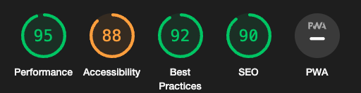   | Accessibility down due to form having placeholders instead of labels. |
| Mobile             | 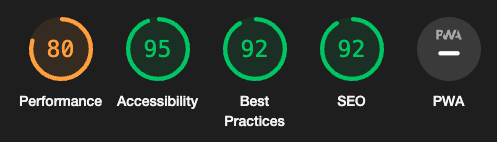     | Performance down due to image sizes.   Accessibility down due to form having placeholders instead of labels. |
| W3C HTML Validator | 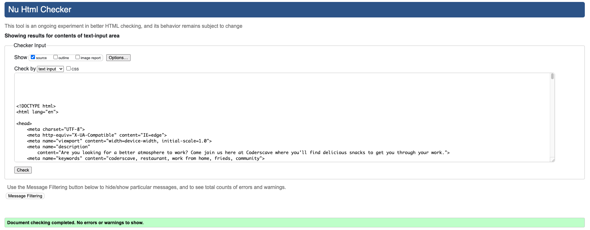          |                                     |

&nbsp;  
### __Login__

[login.html](https://coders-cave-project-4.herokuapp.com/accounts/login/)

|                    | Screenshot                                                        |              Notes                   |
|--------------------|-------------------------------------------------------------------|--------------------------------------|
| Desktop            | 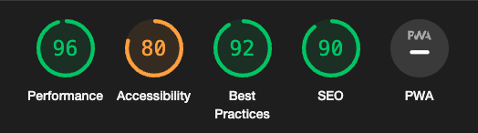 | Accessibility down due to form having placeholders instead of labels. |
| Mobile             | 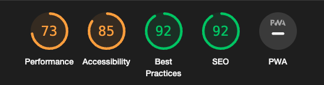   | Performance down due to image sizes.   Accessibility down due to form having placeholders instead of labels. |
| W3C HTML Validator | 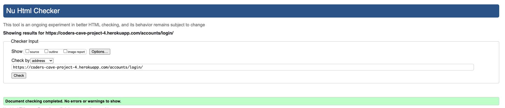        |                                      |

&nbsp;  
### __Logout__

[logout.html](https://coders-cave-project-4.herokuapp.com/accounts/logout/)

|                    | Screenshot                                                            |              Notes                   |
|--------------------|-----------------------------------------------------------------------|--------------------------------------|
| Desktop            | 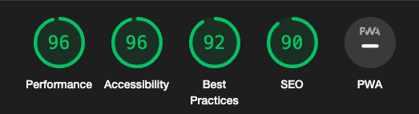   |                                      |
| Mobile             | 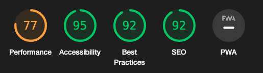     | Performance down due to image sizes. |
| W3C HTML Validator | 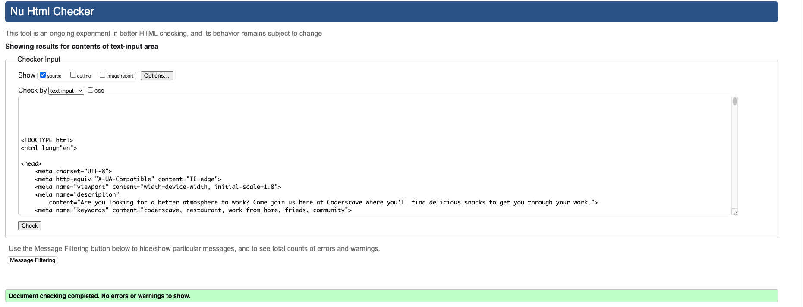          |                                      |

&nbsp;  
### __Signup__

[signup.html](https://coders-cave-project-4.herokuapp.com/accounts/signup/)

|                    | Screenshot                                                            |              Notes                   |
|--------------------|-----------------------------------------------------------------------|--------------------------------------|
| Desktop            | 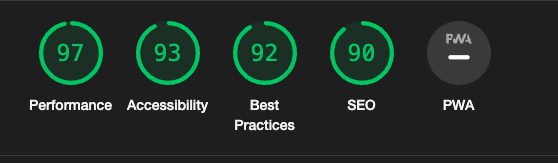   |                                      |
| Mobile             | 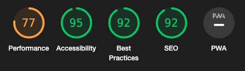     | Performance down due to image sizes. |
| W3C HTML Validator | 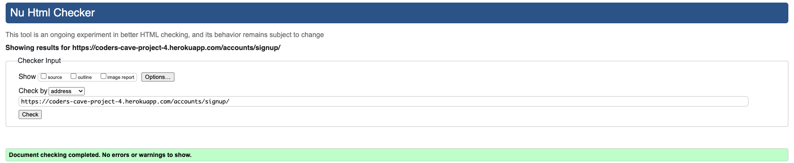          |                                      |

&nbsp;  
### __Booking List__

[my_booking.html](https://coders-cave-project-4.herokuapp.com/book/bookings/)

|                    | Screenshot                                                            |              Notes                   |
|--------------------|-----------------------------------------------------------------------|--------------------------------------|
| Desktop            | 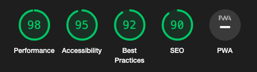 |                                      |
| Mobile             | 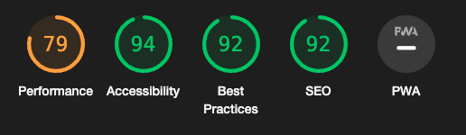   | Performance down due to image sizes. |
| W3C HTML Validator | 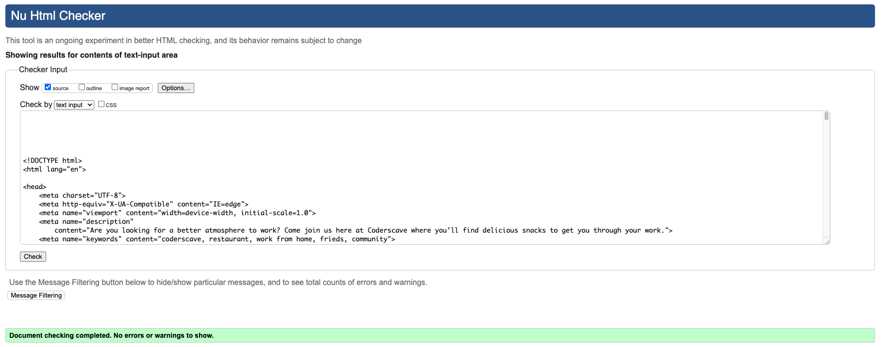        |                                      |

&nbsp;  
### __Update Booking__

|                    | Screenshot                                                            |              Notes                   |
|--------------------|-----------------------------------------------------------------------|--------------------------------------|
| Desktop            | 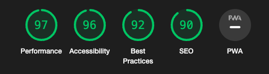   | Accessibility down due to form having placeholders instead of labels. |
| Mobile             |      | Performance down due to image sizes.   Accessibility down due to form having placeholders instead of labels. |
| W3C HTML Validator | 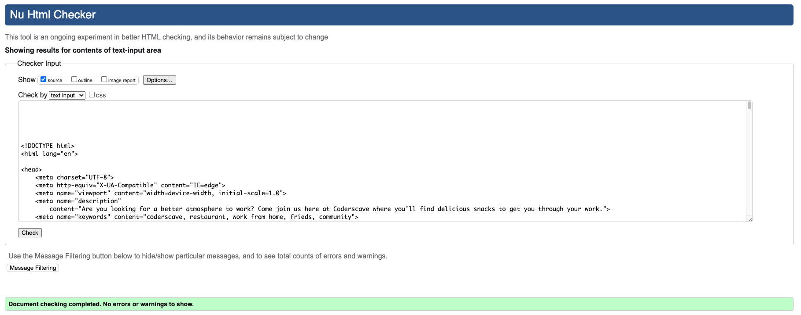          |                                      |

&nbsp;  
### __Delete Booking__

|                    | Screenshot                                                            |              Notes                   |
|--------------------|-----------------------------------------------------------------------|--------------------------------------|
| Desktop            | 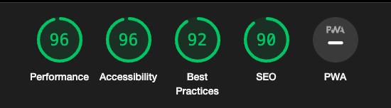   |                                      |
| Mobile             | 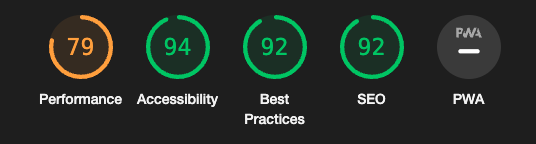     | Performance down due to image sizes. |
| W3C HTML Validator | 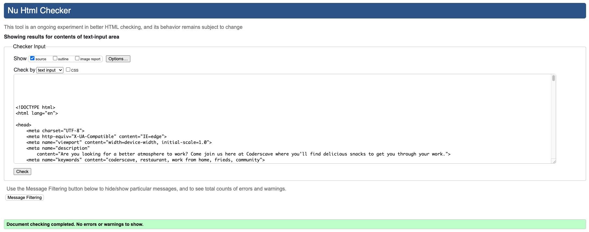          |                                      |

&nbsp;  
### __All Booking List__

[all_bookings.html](https://coders-cave-project-4.herokuapp.com/book/bookings/all-bookings/)

|                    | Screenshot                                                                    |                      Notes                   |
|--------------------|-------------------------------------------------------------------------------|----------------------------------------------|
| Desktop            | 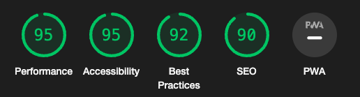 |                                              |
| Mobile             | 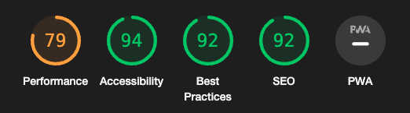   | Performance down due to image sizes.         |
| W3C HTML Validator | 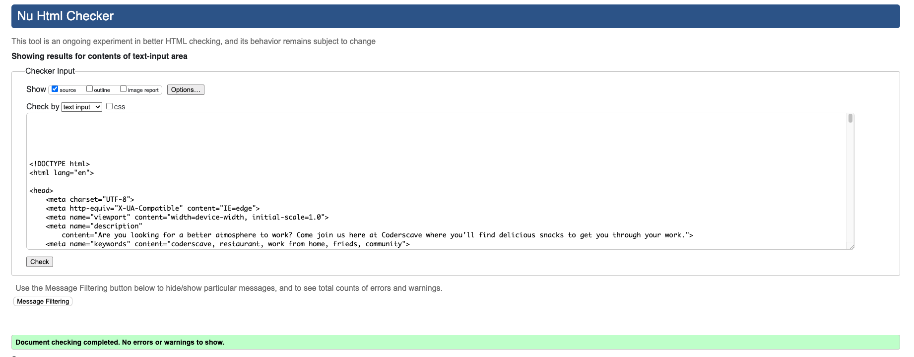        |                                              |

&nbsp;  
### __All Draft Reviews List__

[view_all_draft_reviews.html](https://coders-cave-project-4.herokuapp.com/review/draft-reviews)

|                    | Screenshot                                                                        |                      Notes                   |
|--------------------|-----------------------------------------------------------------------------------|----------------------------------------------|
| Desktop            | 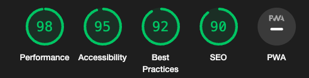 |                                              |
| Mobile             | 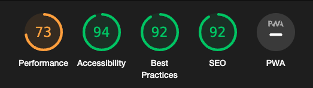   | Performance down due to image sizes.         |
| W3C HTML Validator | 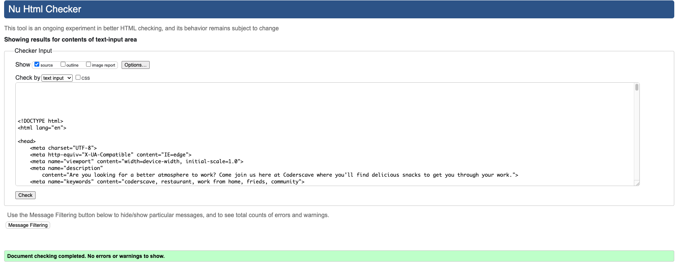        |                                              |

&nbsp;  
### __Review Success__

[view_all_draft_reviews.html](https://coders-cave-project-4.herokuapp.com/review/draft-reviews)

|                    | Screenshot                                                                          |                      Notes                   |
|--------------------|-------------------------------------------------------------------------------------|----------------------------------------------|
| Desktop            | 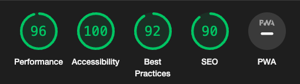 |                                              |
| Mobile             |    | Performance down due to image sizes.         |
| W3C HTML Validator | 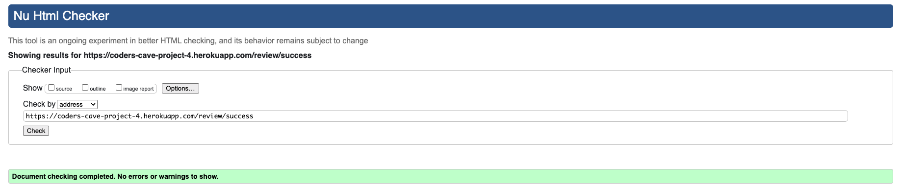        |                                              |

&nbsp;  
### __Publish Review__

|                    | Screenshot                                                                  |              Notes                   |
|--------------------|-----------------------------------------------------------------------------|--------------------------------------|
| Desktop            | 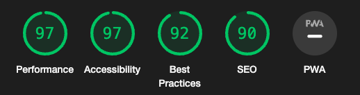 |                                      |
| Mobile             | 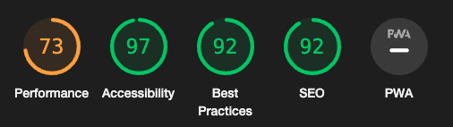  | Performance down due to image sizes. |
| W3C HTML Validator | 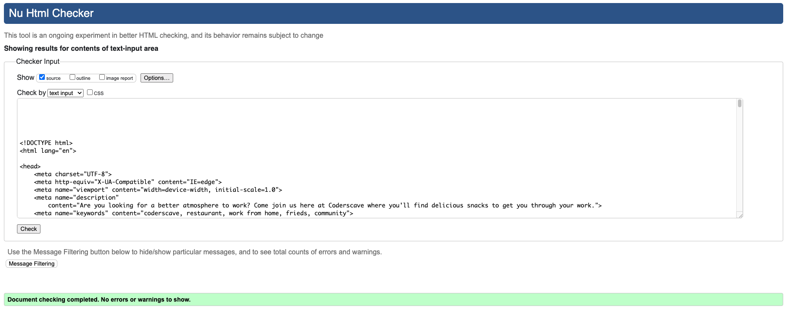          |                                      |

&nbsp;  
### __Delete Review__

|                    | Screenshot                                                                |              Notes                   |
|--------------------|---------------------------------------------------------------------------|--------------------------------------|
| Desktop            | 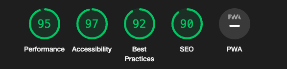 |                                      |
| Mobile             | 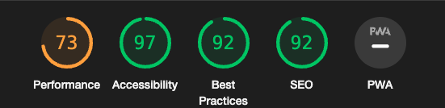  | Performance down due to image sizes. |
| W3C HTML Validator | 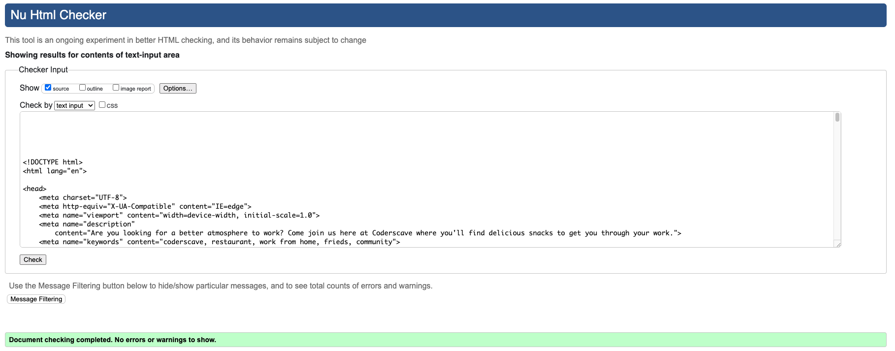          |                                      |

&nbsp;  

## __CSS__

[style.css](https://github.com/LesterCuasay/Project-4/blob/main/static/css/style.css)

- The CSS was tested through direct input instead of testing every single page these are the results:

|                   | Screenshot                                                 |
|-------------------|------------------------------------------------------------|
| W3C CSS Validator |      |

    

&nbsp;  
## __Python__

### __Bookings App__

#### __Bookings Model__

[bookings/models.py](https://github.com/LesterCuasay/Project-4/blob/main/bookings/models.py)

|                   | Screenshot                                                |
|-------------------|-----------------------------------------------------------|
| CI Python Linter  | 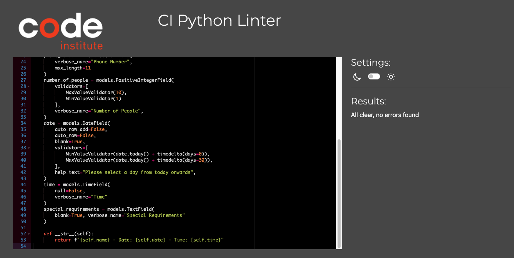 |

&nbsp;  
#### __Bookings Form__

[bookings/forms.py](https://github.com/LesterCuasay/Project-4/blob/main/bookings/forms.py)

|                   | Screenshot                                               |
|-------------------|----------------------------------------------------------|
| CI Python Linter  | 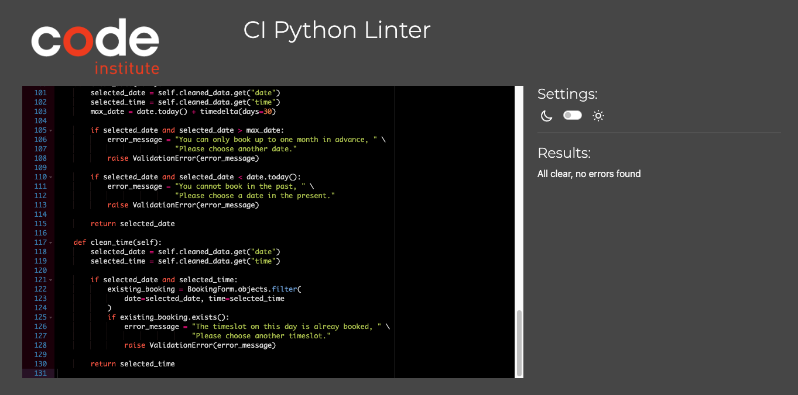 |

&nbsp;  
#### __Bookings View__

[bookings/views.py](https://github.com/LesterCuasay/Project-4/blob/main/bookings/views.py)

|                   | Screenshot                                               |
|-------------------|----------------------------------------------------------|
| CI Python Linter  | 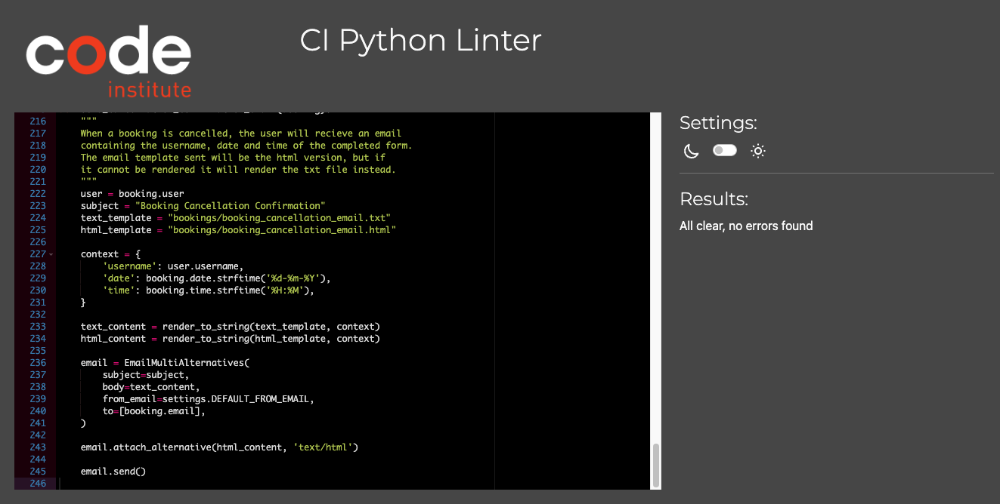 |

&nbsp;  
#### __Bookings Test Form__

[bookings/tests/test_forms.py](https://github.com/LesterCuasay/Project-4/blob/main/bookings/tests/test_forms.py)

|                   | Screenshot                                                             |
|-------------------|------------------------------------------------------------------------|
| CI Python Linter  | 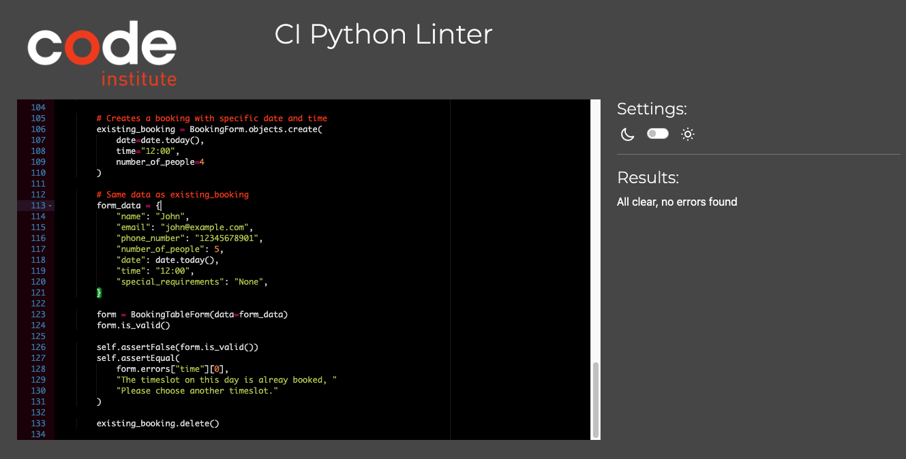     |
| Test Results      | 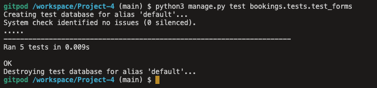 |

&nbsp;  
#### __Bookings Test View__

[bookings/tests/test_views.py](https://github.com/LesterCuasay/Project-4/blob/main/bookings/tests/test_views.py)

|                   | Screenshot                                                             |
|-------------------|------------------------------------------------------------------------|
| CI Python Linter  | 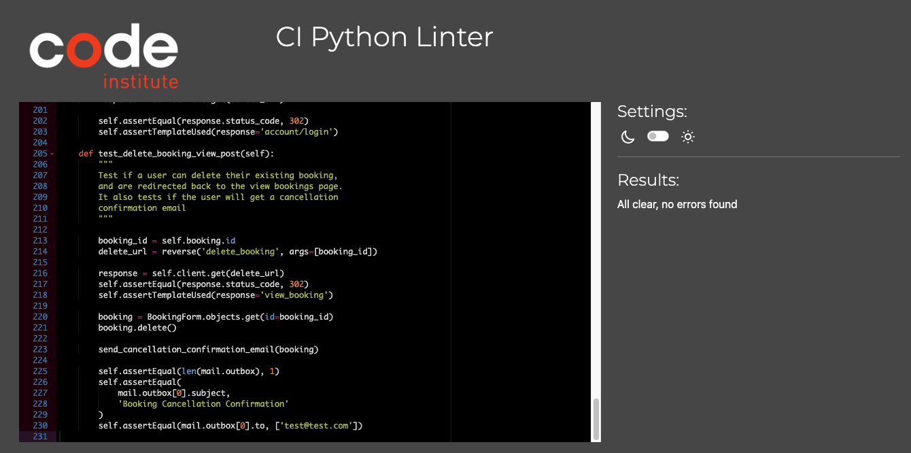     |
| Test Results      | 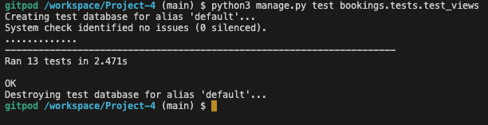 |

&nbsp;  
### __Reviews App__

#### __Reviews Model__

[reviews/models.py](https://github.com/LesterCuasay/Project-4/blob/main/reviews/models.py)

|                   | Screenshot                                              |
|-------------------|---------------------------------------------------------|
| CI Python Linter  | 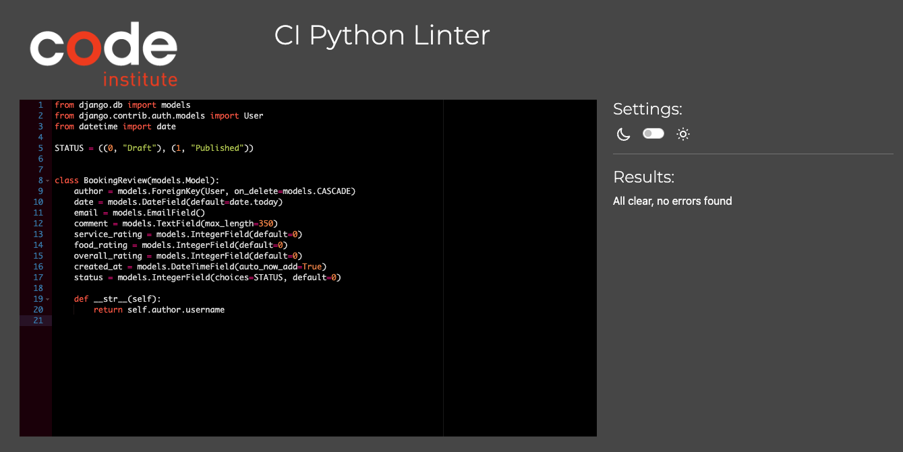 |

&nbsp;  
#### __Reviews Form__

[reviews/forms.py](https://github.com/LesterCuasay/Project-4/blob/main/reviews/forms.py)

|                   | Screenshot                                             |
|-------------------|--------------------------------------------------------|
| CI Python Linter  | 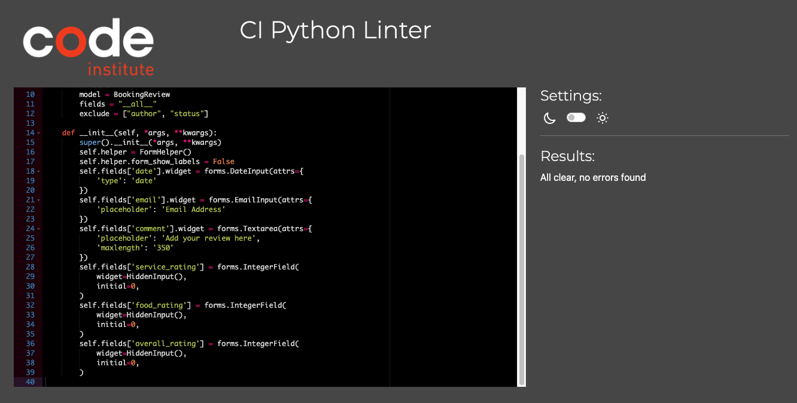 |

&nbsp;  
#### __Reviews View__

[reviews/views.py](https://github.com/LesterCuasay/Project-4/blob/main/reviews/views.py)

|                   | Screenshot                                             |
|-------------------|--------------------------------------------------------|
| CI Python Linter  | 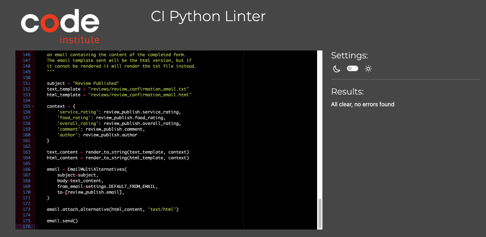 |

&nbsp;  
#### __Reviews Test Form__

[reviews/tests/test_forms.py](https://github.com/LesterCuasay/Project-4/blob/main/reviews/tests/test_forms.py)

|                   | Screenshot                                                           |
|-------------------|----------------------------------------------------------------------|
| CI Python Linter  | 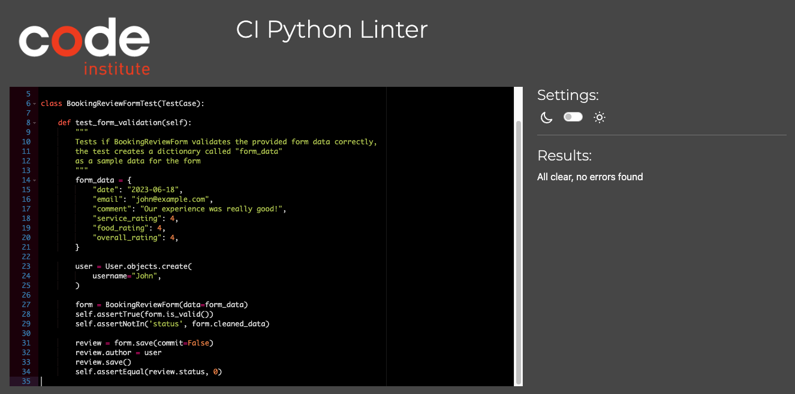     |
| Test Results      | 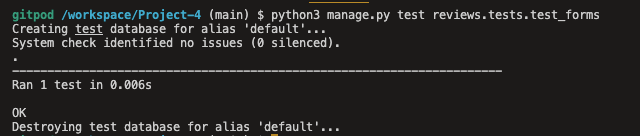 |

&nbsp;  
#### __Reviews Test View__

[reviews/tests/test_views.py](https://github.com/LesterCuasay/Project-4/blob/main/reviews/tests/test_views.py)

|                   | Screenshot                                                           |
|-------------------|----------------------------------------------------------------------|
| CI Python Linter  | 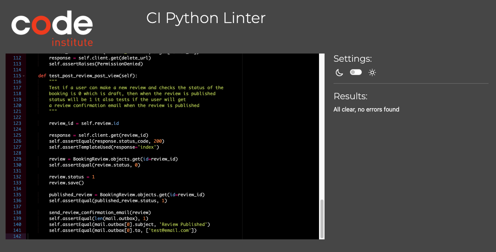     |
| Test Results      | 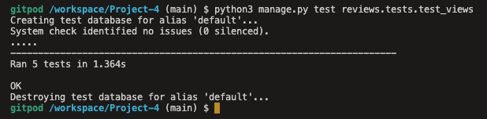 |

&nbsp;  
## __JavaScript__

[script.js](https://github.com/LesterCuasay/Project-4/blob/main/static/js/script.js)

|         | Screenshot                                           |
|---------|------------------------------------------------------|
| JShint  | 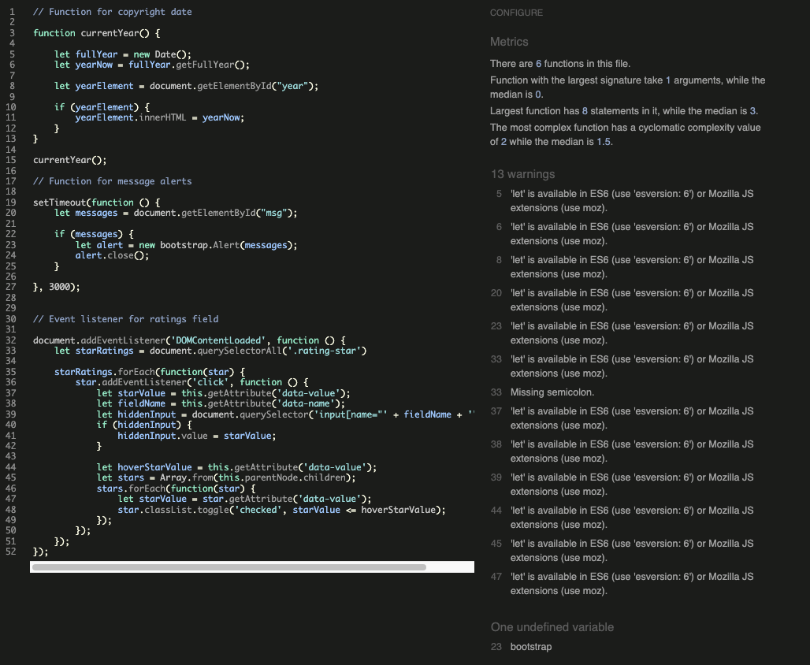 |

&nbsp;  
        
        
