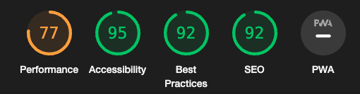
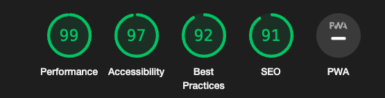
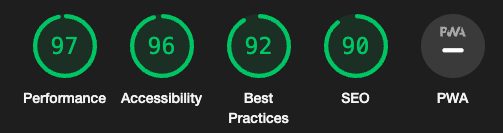

## __Testing__

Head back to the [README.md](README.md) file.

&nbsp;

## __Introduction__

To make sure that my website is running as intended, I will be using different tools to see its performance.

- Every page will be testing on lighthouse for Desktop and Mobile.
- Every page's HTML will be checked on [W3C Validator](https://validator.w3.org/)
    - For the HTML pages that requires users to be authenticated I will be validating the HTML through direct input using the page source as W3C is not authenticated it will not see my if authenticated template syntax.
- Every page's CSS will be checked on [W3C Validator - Jigsaw](https://jigsaw.w3.org/css-validator/)
- Every Python code will be checked on [Code Institute Python Linter](https://pep8ci.herokuapp.com/)
- Every JavaScript code will be checked on [JShint](https://jshint.com/)

### __Homepage__

[index.html](https://coders-cave-project-4.herokuapp.com/)

#### __Desktop__

#### __Mobile__

- Performance down due to image sizes

#### __W3C HTML Validator__

&nbsp;  
### __Menu__

[menu.html](https://coders-cave-project-4.herokuapp.com/menu)

#### __Desktop__

#### __Mobile__

- Performance down due to image sizes

#### __W3C HTML Validator__

&nbsp;  
### __Book__

[book.html](https://coders-cave-project-4.herokuapp.com/menu)

#### __Desktop__

- Accessibility down due to form having placeholders instead of labels

#### __Mobile__

- Performance down due to image sizes
- Accessibility down due to form having placeholders instead of labels

#### __W3C HTML Validator__

&nbsp;  
### __Login__

[login.html](https://coders-cave-project-4.herokuapp.com/accounts/login/)

#### __Desktop__

- Accessibility down due to form having placeholders instead of labels

#### __Mobile__

- Performance down due to image sizes
- Accessibility down due to form having placeholders instead of labels

#### __W3C HTML Validator__

&nbsp;  
### __Logout__

[logout.html](https://coders-cave-project-4.herokuapp.com/accounts/logout/)

#### __Desktop__

#### __Mobile__

- Performance down due to image sizes

#### __W3C HTML Validator__

&nbsp;  
### __Signup__

[signup.html](https://coders-cave-project-4.herokuapp.com/accounts/signup/)

#### __Desktop__

#### __Mobile__

- Performance down due to image sizes

#### __W3C HTML Validator__

&nbsp;  

