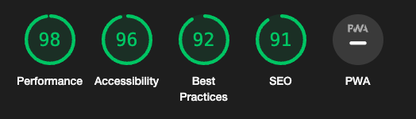

## __Testing__

Head back to the [README.md](README.md) file.

&nbsp;

## __Introduction__

To make sure that my website is running as intended, I will be using different tools to see its performance.

- Every page will be testing on lighthouse for Desktop and Mobile.
- Every page's HTML will be checked on [W3C Validator](https://validator.w3.org/)
- Every page's CSS will be checked on [W3C Validator - Jigsaw](https://jigsaw.w3.org/css-validator/)
- Every Python code will be checked on [Code Institute Python Linter](https://pep8ci.herokuapp.com/)
- Every JavaScript code will be checked on [JShint](https://jshint.com/)

### __Homepage__

[index.html](https://coders-cave-project-4.herokuapp.com/)

#### __Desktop__

#### __Mobile__

